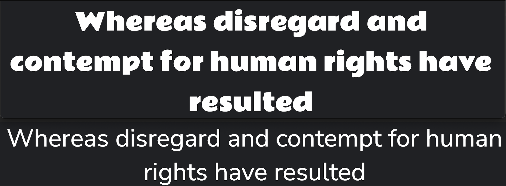

# Lightsaber Legends

Lightsaber Legends is an electrifying online version of Top Trumps that immerses Star Wars fans in the epic galaxy far, far away! This thrilling game lets you pit iconic characters like Luke Skywalker, Darth Vader, and Rey against each other, comparing their unique attributes and abilities. Each duel is a chance to showcase your strategic skills and Star Wars knowledge, making every victory even sweeter. Whether you're a Jedi Master or a Sith Lord, Lightsaber Legends offers an engaging, force-filled experience that no Star Wars aficionado can resist!

Visit the deployed website [here](https://callumdennisie.github.io/2405-hackathon-team3/).

## Table of contents
1. [User Experience (UX)](#user-experience-ux)
    1. [Project Goals](#project-goals)
    2. [User Stories](#user-stories)
    3. [Color Scheme](#color-scheme)
    4. [Typography](#typography)
2. [Features](#features)
    1. [General](#general)
    2. [Game Area](#game-area)
    3. [Popups](#popups)
    4. [404 Page](#404-page)
3. [Technologies Used](#technologies-used)
    1. [Languages](#languagesd)
    2. [Frameworks, Libraries, and Programs](#frameworks-libraries-and-programs)
4. [Testing](#testing)
    1. [Testing User Stories](#testing-user-stories)
    2. [Code Validation](#code-validation)
    3. [Accessibility](#accessibility)
    4. [Tools Testing](#tools-testing)
    5. [Manual Testing](#manual-testing)
5. [Finished Product](#finished-product)
6. [Deployment](#deployment)
    1. [GitHub Pages](#github-pages)
7. [Credits](#credits)
    1. [Content](#content)
    2. [Media](#media)
    3. [Code](#code)
8. [Acknowledgements](#acknowledgements)

## User Experience (UX)
### Project Goals
- The website shoud incorporate a responsive design to make the game accessible on different devices.
- The website should provide an intuitive structure and navigation.
- The website should provide the user with feedback about their game outcome.

### User Stories
- As a user, I want the website to be easy to navigate.
- As a user, I want the game to be fun and engaging.
- As a user, I want to receive feedback about my performance in the game.
- As a user, I want to be able to easily review the rules.
- As a user, I want to be able to play the game on different devices.

### Color Scheme

The main colors used on the website are:
- Two shades of blue, #007BFF and #0056B3, for the buttons and their hover effects,
- Mustard yellow, #FFDD57, for the headers,
- Gold, #D19E2F, for the text in the instructions pane,
- Off-white, #E2EAEC, for the error message when the user enters an invalid username.

### Typography

The following fonts from [Google Fonts](https://fonts.google.com/) were used on this website:

- Nunito is used as its main font.
- Rammetto One is used for headings.

The fallback font, in case either font isn't loaded correctly, is Sans Serif.

[Back to top ⇧](#lightsaber-legends)

## Features
### General
- The site was built using a mobile-first approach. 
- Media queries were used to adapt features for larger screens to ensure responsive designs across different screen sizes. 

### Game Area
**Board**

**Game Over Announcement**

**Victory Announcement**

### Popups
**Instructions Popup**

### 404 Page

- This page is displayed in case of broken or misspelled links and contains a link back to the main page.

[Back to top ⇧](#lightsaber-legends)

## Technologies Used
### Languages
- [HTML5](https://en.wikipedia.org/wiki/HTML5)
- [CSS3](https://en.wikipedia.org/wiki/CSS)
- [Javascript](https://en.wikipedia.org/wiki/JavaScript)

### Frameworks, Libraries, and Programs 
- [Google Fonts](https://fonts.google.com/) was used to find suitable font pairings and import the chosen fonts.

- [Font Awesome](https://fontawesome.com/) was used to add icons to create a better visual experience for UX purposes.

- [Favicon](favicon.io) was used to create and import a favicon for the website.

- [Microsoft Copilot](https://copilot.microsoft.com/) was used to help generate the About section on the game cards.

- [JPG to PNG](https://jpg2png.com/) was used to convert all images to PNG format.

- [Veed.io](https://www.veed.io/) was used to convert a screen recording into a gif.

- [Balsamiq](https://balsamiq.com/) was used to create the wireframes during the design phase of the project.

- [GitPod](https://gitpod.io/) was used for writing code, committing, and then pushing to GitHub.

- [GitHub](https://github.com/) was used to store the project after pushing.

- [Am I Responsive?](http://ami.responsivedesign.is/#) was used to ensure responsive design throughout the process and to generate the mockup images at the top of this file.

- [Chrome DevTools](https://developer.chrome.com/docs/devtools/) was used during the development process for code review and to test responsiveness and accessibility.

- [W3C Markup Validator](https://validator.w3.org/) was used to validate the HTML code.

- [W3C CSS Validator](https://jigsaw.w3.org/css-validator/) was used to validate the CSS code.

- [JSHint](https://jshint.com/) was used to validate the site's JavaScript code.

[Back to top ⇧](#lightsaber-legends)

## Testing
### Testing User Stories

As a user, I want the website to be easy to navigate.
 - Everything is presented on one page to minimize the need to switch between pages.
 - Buttons are clearly labelled and easy to find.

As a user, I want the game to be fun and engaging.
 - The base game, Top Trump, is well known among players of all ages, allowing even the youngest Star Wars fans to participate in this game.
 - The cards are designed using some of the most popular figures across the Star Wars universe, allowing users to reconnect with their favorite characters.
 - The game uses sound effects of iconic Star Wars sounds, allowing users to enjoy the experience with multiple senses.
 - The game provides feedback and a victory sound to keep the user motivated and engaged.
 - The game contains many Easter Eggs in the form of gifs and quotes to keep users entertained. 

As a user, I want to receive feedback about my performance in the game.
 - The game provides feedback after a game ends in a win, loss, or draw.
 - At the end of the game, a victory sound plays.

As a user, I want to be able to easily review the rules.
 - The instructions are readily available via the "Instructions" button below the game board.
 - The instructions are kept clear and concise.

As a user, I want to be able to play the game on different devices.
 - The website is fully responsive and displays well across devices of different sizes.
 - The game is fully interactive on touchscreen devices as well as with a mouse or trackpad.

### Code Validation
[W3C Markup Validator](https://validator.w3.org/), [W3C CSS Validator](https://jigsaw.w3.org/css-validator/), and [JSHint](https://jshint.com/) were used to validate the project to ensure there were no errors in the code.

**HTML Validation**
- Home Page
 

 - 404 Page
 

**CSS Validation**
 

**JavaScript Validation**
 

### Accessibility

**Lighthouse Reports**
[Lighthouse](https://developer.chrome.com/docs/lighthouse/overview) in [Chrome DevTools](https://developer.chrome.com/docs/devtools/) was used to measure the quality of each page, focussing on performance, accessibility, best practices, and SEO scores.

**Lighthouse Reports**
- Home Page
 

- 404 Page
 

### Tools Testing

### Manual Testing
**Browser Compatibility**
Browser | Outcome | Pass/Fail
--- | --- | ---
Google Chrome | No issues with appearance, responsiveness, or functionality. | Pass
Safari | Issues with appearance, responsiveness, or functionality.* | Fail
Mozilla Firefox | No issues with appearance, responsiveness, or functionality. | Pass
Microsoft Edge | No issues with appearance, responsiveness, or functionality. | Pass
JoyUI Native Browser | No issues with appearance, responsiveness, or functionality. | Pass

**Device Compatibility**
Device | Outcome | Pass/Fail
--- | --- | ---
MacBook Pro 13" | Issues with appearance, responsiveness, or functionality.* | Fail
iPhone 13 Mini | Issues with appearance, responsiveness, or functionality.* | Fail
iPad 9th Generation | Issues with appearance, responsiveness, or functionality.* | Fail
Acer Predator Helios 300 | No issues with appearance, responsiveness, or functionality. | Pass
Black Shark PAR-HOA | No issues with appearance, responsiveness, or functionality. | Pass
Samsung Galaxy A34 | No issues with appearance, responsiveness, or functionality. | Pass

*Comment: On Safari on Mac and iOS, the cards on the stacks display mirrored and face-side up rather than cover-side up.

**Common Elements Testing**

Feature | Outcome | Pass/Fail
--- | --- | ---
Add Feature Here | Add Outcome Here | Pass

Name Input
Feature | Outcome | Pass/Fail
--- | --- | ---
Player enters a name | Player is greeting by name | Pass
Player doesn't enter a name | An message appears | Pass

Instructions Popup
Feature | Outcome | Pass/Fail
--- | --- | ---
Clicking i symbol | Instructions are displayed as popup | Pass
Clicking x symbol | Instructions popup is closed | Pass

End Game Screens
Feature | Outcome | Pass/Fail
--- | --- | ---
Game Over Screen | A gif plays in the background | Pass
Victory Screen | A gif plays in the background | Pass
End Game Screens | Screens appear for a few seconds when the game ends | Pass

Buttons
Feature | Outcome | Pass/Fail
--- | --- | ---
Hovering over a button | Slight color change  to provide feedback | Pass

404 Page
Feature | Outcome | Pass/Fail
--- | --- | ---
404 Page | A broken or misspelled address will redirect the user to the 404 page | Pass
404 Page | A gif plays in the background | Pass
Clicking on the Button | The user is taken back to the main page | Pass

[Back to top ⇧](#lightsaber-legends)

## Finished Product
Page | Desktop Version | Mobile Version
--- | --- | ---
Home |  | 

[Back to top ⇧](#lightsaber-legends)

## Deployment
This website was developed using [GitPod](https://www.gitpod.io/), which was then committed and pushed to [GitHub](https://github.com/) using the GitPod terminal.

### GitHub Pages
Here are the steps to deploy a website to GitHub Pages from its GitHub repository:

1. Log in to GitHub and locate the [GitHub Repository](https://github.com/).
2. At the top of the Repository, locate the Settings button on the menu.
3. Scroll down the Settings page until you locate the Pages section.
4. Under Source, click the dropdown called None and select Master Branch.
5. The page will refresh automatically and generate a link to your website.

[Back to top ⇧](#lightsaber-legends)

## Credits

### Content
All content was written by the developers.

### Media
The sounds used on the website were downloaded from [Pixabay](https://pixabay.com/) and [Voicy](https://voicy.network).

The background image was created using [Getimg.ai](https://getimg.ai/).

The gifs for the Game Over Screen, the Victory Screen, and the 404-Page were dpwnloaded from [Gifs.com](https://gifs.com/).

The cards were created using [Canva](https://www.canva.com/).
- The images were downloaded from [Star Wars Database](https://www.starwars.com/) and [Wookiepedia](https://starwars.fandom.com/wiki/Main_Page)
- The About section was written with the help of [Microsoft Copilot](https://copilot.microsoft.com/).

### Code
[Stack Overflow](https://stackoverflow.com/), [CSS Tricks](https://css-tricks.com/), and [W3Schools](https://www.w3schools.com/) were consulted on a regular basis for troubleshooting and inspiration.

[Back to top ⇧](#lightsaber-legends)

## Acknowledgements

- Andrew Dempsey
- Suzanne Deakin 
- Code Institute
